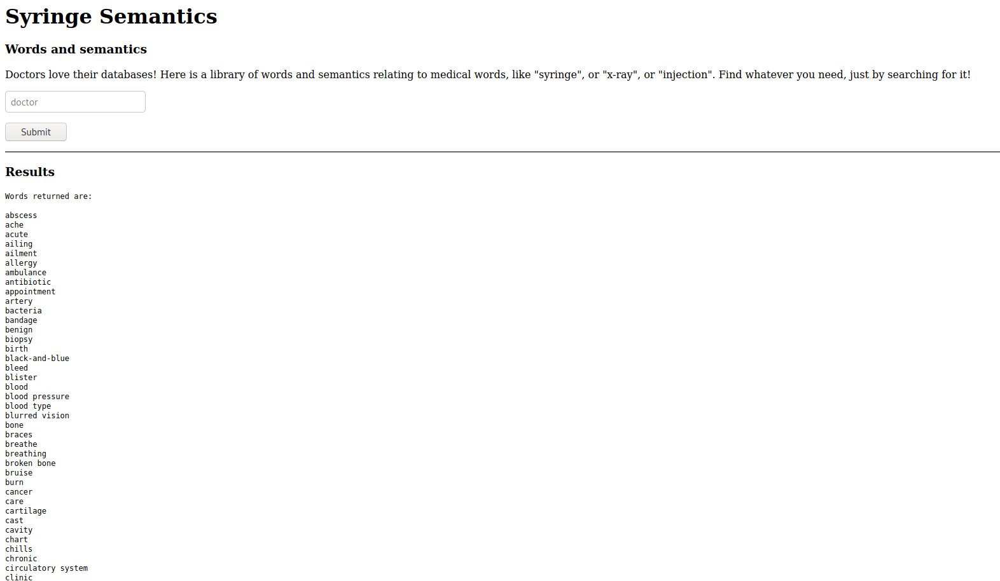
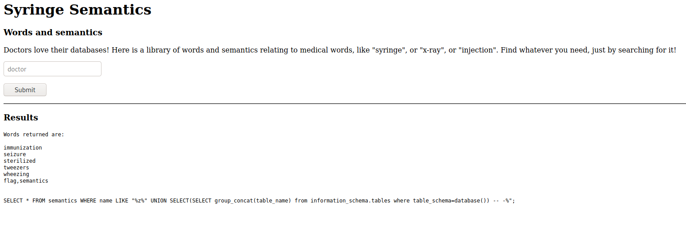

**CHALLENGE DESCRIPTION:**
    
    Author: @JohnHammond#6971

    Doctors love their databases! 
    Here is a library of words and semantics relating to medical words,
    like "syringe", or "x-ray", or "injection". 
    Find whatever you need, just by searching for it!
    Connect with: http://challenge.ctf.games:30501

**CHALLENGE SOLUTION:**
    
    When navigating to the site, we are greeted with a simple page:

    Hmmm. the challenge is called syringe, it mentions 'injection', and databases are involved... Lets try SQLI!

    As always, we take a quick glance at the page source in case any hints are there... and there is! Right at the bottom we have a html comment:
    
    *<!-- if ( isset($_GET["debug"])){ echo($sql_query); } -->*
    

    Okay, so we change our URL to include the PHP parameter of 'debug': http://challenge.ctf.games:30501/?debug
    Now, when we enter a string in the search box we get to see the SQL statement that runs:
    

    So, we can see it is using double quotes... From testing it was found that an invalid SQL Query search (such as *z%"*, which makes the query 
    *SELECT * FROM semantics WHERE name LIKE "%z%" %";*), returned no results, whereas a valid SQL query (such as *z%" -- -*) does return results. This way we can tell if our query is correct or not...

    Next, I used https://www.acunetix.com/blog/articles/exploiting-sql-injection-example/ as a cheatsheet for SQLI in MYSQL.

    The payload used was:
    *z%" UNION SELECT(SELECT group_concat(table_name) from information_schema.tables where table_schema=database()) -- -*

    This gave table names at the bottom of all returned results:

    Next the query was changed to extract everything from the table 'flag':

    * z%"   UNION SELECT(SELECT * from flag)    -- - *

    This gave the flag!

